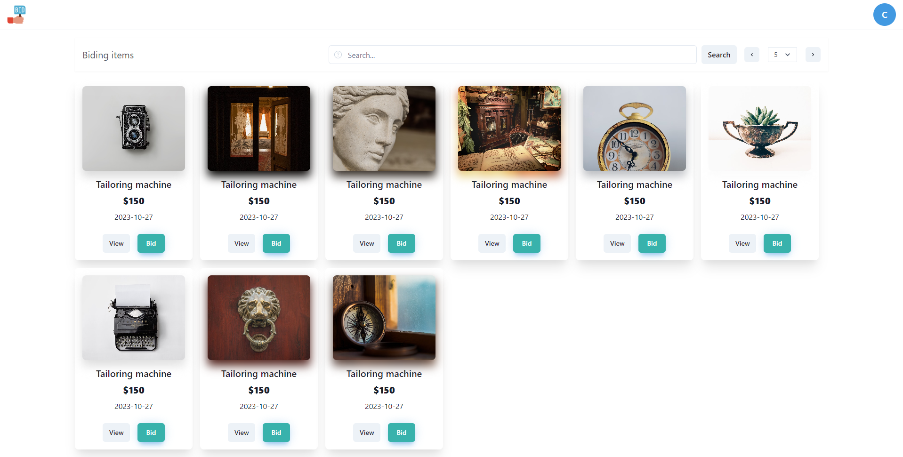
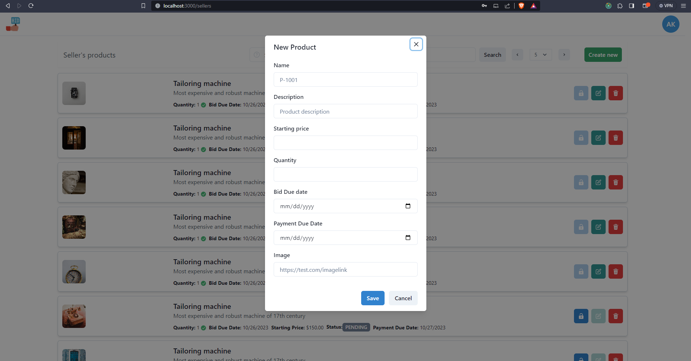

### Auction system
## prerequisites

1. Node > 18, and npm installed
2. VScode

## Bootstrap application

1. run this script ```npm install & npm run start```
2. enjoy the ride

Project is still in progress:

First iteration be



.png>)
.png>)
.png>)
.png>)
.png>)
.png>)
